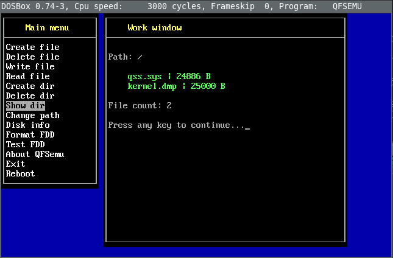

# Quick Simple Operating System (QSOS)

This is my (very old) attempt to create an operating system.

It is actually very simple kernel written in x86 assembly and C. In order to run it, it must be stored on 3,5" floppy disk.
It uses custom file system (QFS). The system can run COM programs and allows to chat with single person through RS-232.

It is the result of my learning of assembly and C in the past (1999-2005).

## How to run

In the past, I used VMWare Player, but nowadays I use `qemu`. The operating system itself has to be on a floppy disk, which is
prepared in QSS/bin/floppy.flp file. We need to pass it to qemu:


```
qemu-system-i386 -boot order=a -fda floppy.flp -no-fd-bootchk
```

In order to load local files onto a floppy disk, you require QFS emulator, which is a DOS program underastanding the QSS filesystem.
Yes, this OS uses custom filesystem, called QFS (Quick File System). In order to run it, I use DOSBox:

```
> dosbox

C:\> imgmount A floppy.flp -t floppy
C:\> cd QSS\bin
C:\QSS\bin> QFSEMU.EXE
```

You will see the following screen:



In order to write some files in the floppy, it is a 2-phase process:

1. "Create file" -> creates empty file in the floppy
2. "Write file" -> First enter target file in the floppy, then source file in local filesystem. Better if it is in the current dir.


## Compilation

Prerequisities are:

- Borland C++ 3.1
- Turbo Assembler 3.0
